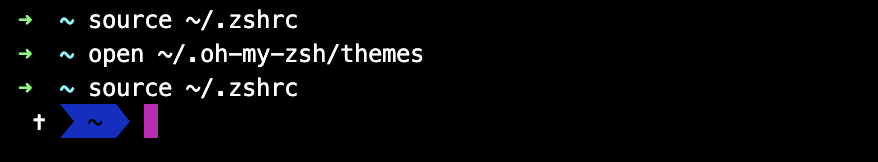
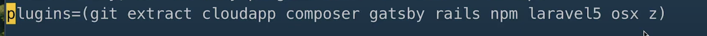
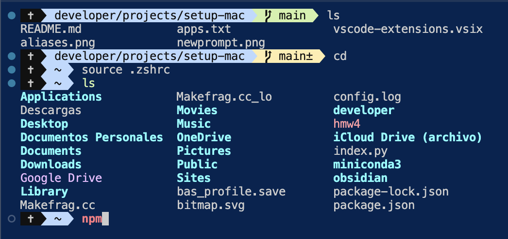

# Why
List of the steps for setup my mac


## Developer Installation
1. xcode
2. Homebrew
3. VsCode
4. Fnm
5. NodeJs
6. Svelte
7. miniconda (manage multiple versions of Python)
8. Python
9. R Studio
10. Docker (optional)
11. Themes and highlighting for terminal

## File Structure
1. File structure


## VsCode Extensions
### Previous steps
- Go to the palette and choose Install 'code' command in PATH 

### List of Extensions
- code --list-extensions --show-versions
- If you want to install them from list, import as an VSIX file

## Configurations
### Python with miniconda
#### Create an environment (useful for pytorch and tensorflow too)
- conda create --name py310
- conda activate py310
- conda install python=3.10
- python --version

## MAC apps
The complete list is in apps.txt. To copy, go to terminal, select and copy

## References
[Setting up new Mac](https://www.youtube.com/watch?v=mmkDyV59nRo&t=250s)
- For multiple python installations see 22:50

## VsCode powerful configurations
[¡Necesitas cambiar estas configuraciones de Visual Studio Code!](https://www.youtube.com/watch?v=uyEUVgNMvGI)

- cursor blinking: cursos expandido
- linked editing: para editar html tags apertura y cierre
- bracket pair colorization: colorea `()` y `{}` dependiendo de la profundidad
- breadcrums: elimina el breadcrum de arriba
- sticky scroll: fija una guia y te avisa en que función o archivo te encuentras


## My Zsh configuration
Install *hyper.js* which replace your default terminal with an styled terminal and ohmyz to styled the prompt.

- Go to [My zsh](https://ohmyz.sh/) and install, don't forget to re install your hyper terminal.
- Go to [powerline/fonts](https://github.com/powerline/fonts), download the repository and add the folder *Mesio Dotted* to your mac fonts book.
- Go to hyper/preferences and add the font

 Now style the prompt
 - Go to [cobalt2-iterm](https://github.com/wesbos/Cobalt2-iterm) and download the project
 - Move the theme to zshrc directory
 ```sh
 open ~/.oh-my-zsh/themes
 ```
- Open .zshrc and modify ZSH_THEME="cobalt2". It will display


- Go to [ohmyzsh](https://github.com/ohmyzsh/ohmyzsh/wiki)
to see the alias. Test it


- If you migrate from bash to zsh, Add the following to your .zshrc profile:
```zsh
eval "$(fnm env --use-on-cd --shell zsh)"
```


## Zsh Syntax Highlightting
Hightlights what you type in terminal
- Go to [zsh-syntax-highlighting](https://github.com/zsh-users/zsh-syntax-highlighting?tab=readme-ov-file) and look at INSTALL.md 
- Because you have already install oh-my-zsh you only need to clone and activate the plugin in `~/.zshrc`. Restart zsh.



